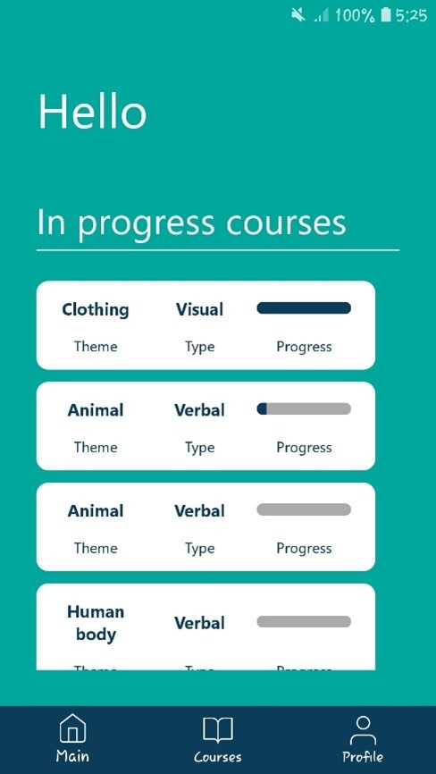
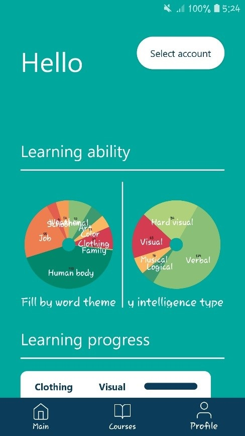
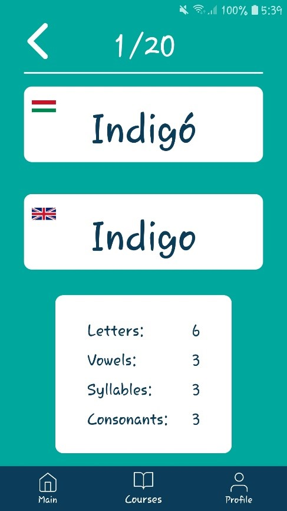
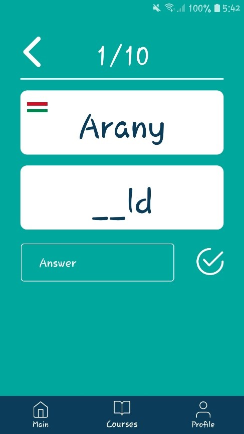

# Szókincsfejlesztó program írása Howard Gardner többszörös intelligencia elmélete alapján Android platformon

### Dissertation project by Kristóf Dróth

 

Sample images

<table>
  <tr>
    <td>Splash screen</td>
     <td>Main screen</td>
  </tr>
  <tr>
    <td></td>
    <td></td>
  </tr>
    <tr>
    <td>Course screen</td>
     <td>Statistic screen</td>
  </tr>
  <tr>
    <td></td>
    <td></td>
  </tr>
    <tr>
    <td>Learning screen</td>
     <td>Learning screen</td>
  </tr>
  <tr>
    <td></td>
    <td></td>
  </tr>
    <tr>
    <td>Learning screen</td>
     <td>Learning screen</td>
  </tr>
  <tr>
    <td></td>
    <td></td>
  </tr>
 </table>

